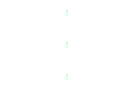
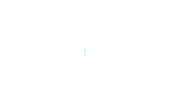
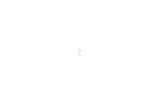
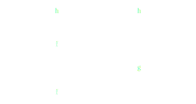

Parallel Data Analysis
----------------------

* *Aron Ahmadia*:  Capital One

* *Ben Zaitlen*:  Anaconda Inc.

* *Min Ragan-Kelley*:  Simula/Jupyter

* *Matthew Rocklin*:  Anaconda Inc.

[gitter.im/pydata/parallel-tutorial](https://gitter.im/pydata/parallel-tutorial)

[pydata.github.io/parallel-tutorial](https://pydata.github.io/parallel-tutorial)

## Outline

1.  Algorithms
    1.  Map - The simple, common case
    2.  Submit - Full freedom
    3.  Collections - For common structures
    4.  Data science application
2.  Distributed Systems
    1.  Extending these same APIs to larger systems
    2.  New computation and communication costs
    3.  Tuning and diagnostics

### `map` - The simple, common case

    outputs = []
    for i in inputs:
        outputs.append(f(i))

    # or

    outputs = [f(i) for i in inputs]

    # or

    outputs = map(f, inputs)

Implemented by *many* frameworks

    concurrent.futures, dask, ipyparallel, joblib, multiprocessing, spark

### `map` - The simple, common case

Frameworks provide a function `map` that takes a function and a sequence and
applies that function in parallel.

    from concurrent.futures import ThreadPoolExecutor

    executor = ThreadPoolExecutor(max_workers=4)

    # outputs = map(function, inputs)       # old sequential code
    outputs = executor.map(function, inputs)  # new parallel code

### `map` - The simple, common case

Frameworks provide a function `map` that takes a function and a sequence and
applies that function in parallel.

    from framework import System

    system = System(initialization_parameters)

    # outputs = map(function, inputs)       # old sequential code
    outputs = system.map(function, inputs)  # new parallel code

### `submit` - Unstructured

    .
    outputs = {}
    for a in L1:
        for b in L2:
            if a > b:
                outputs[a, b] = f(a, b)
            else:
                outputs[a, b] = g(a, b)

    .

No restrictions here, but also no magic.  Developer retains full control.

    concurrent.futures, dask, ipyparallel, airflow, luigi

### `submit` - Unstructured

    e = concurrent.futures.ThreadPoolExecutor()
    futures = {}
    for a in L1:
        for b in L2:
            if a > b:
                futures[a, b] = e.submit(f, a, b)  # submit to background thread
            else:
                futures[a, b] = e.submit(g, a, b)  # submit to background thread

    outputs = {k: v.result() for k, v in futures}  # block until all finished

No restrictions here, but also no magic.  Developer retains full control.

    concurrent.futures, dask, ipyparallel, airflow, luigi

### `submit` - Unstructured

*  Submit tasks to framework one-by-one.
*  Tasks sit in queue until a worker thread executes them
*  Collect result when done

    future = system.submit(function, *args, **kwargs)  # f(*args, **kwargs)

    ... # Do other things

    result = future.result()  # block until done

### `submit` - Unstructured

*  Submit tasks to framework one-by-one.
*  Tasks sit in queue until a worker thread executes them
*  Collect result when done

    futures = []
    for i in inputs:
        futures.append(system.submit(function, i))

    results = [f.result() for f in futures]  # block until done

### `submit` - Unstructured

*  Submit tasks to framework one-by-one.
*  Tasks sit in queue until a worker thread executes them
*  Collect result when done

    outputs = set()                     # Sequential
    for a in L1:
        for b in L2:
            if a > b:
                outputs.add(f(a, b))
            else:
                outputs.add(g(a, b))

    futures = set()                     # Parallel
    for a in L1:
        for b in L2:
            if a > b:
                outputs.add(system.submit(f, a, b))
            else:
                outputs.add(system.submit(g, a, b))

    results = {f.result() for f in futures}

### Collections - Semi-structured

    (x.T.dot(x) + 1).sum()                  # big arrays
    collection.map(f).groupby(key).count()  # big lists
    df.groupby(df.time).value.mean()        # big dataframes
    SELECT * FROM table WHERE ...           # SQL

### Collections provide a fixed set of operations

*  `collection.map(function)`
*  `collection.filter(predicate)`
*  `collection.groupby(key)`
*  `collection.join(other_collection)`

### Chain operations together for complex computations

    collection.map(function)
              .filter(predicate)
              .groupby(key)
              .reduction()

Implemented by

    databases, spark, dask, big array libraries, etc..

### Compare algorithm types

*  Map
    *  Most common problem type
    *  Easy to find a good framework to match
    *  Really consistent API
*  Submit
    *  Most flexible solution type
    *  Less common for distributed frameworks, but available
*  Collections
    *  Convenient when the problem fits
    *  Frameworks abound, some awkwardness in rewriting
