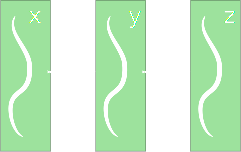
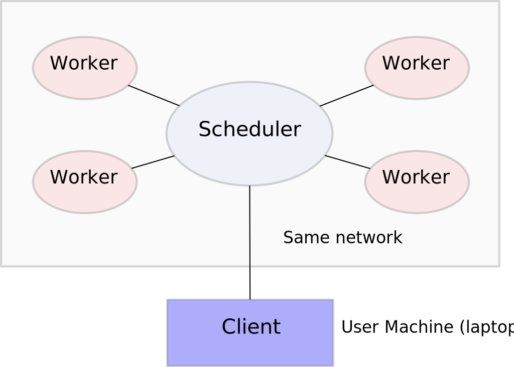

Threads v. Processes
--------------------

*  

    **Multithreading**:

    *  Share data
    *  C/NumPy/Pandas
    *  Fast but dangerous

*  **Multiprocessing**:

    

    *  Transfer data
    *  Pure Python
    *  Avoids GIL issues


Distributed Systems
-------------------

Multiple computers talk to each other over network sockets


Extreme version of multi-processing.  Lose shared disk, shared software
environments, etc..


Distributed Systems
-------------------




Communication Bandwidth
-----------------------

Workers communicate with various technologies.

These mechanisms all have associated speeds.

*  Shared memory (threads): **Infinite**
*  Inter-Process-Communication: **300 MB/s**
*  Ethernet:  **100 MB/s** to  **1000 MB/s**


## Serialization

-  Turns Python objects into bytes

    ```python
    >>> pickle.dumps(123)
    b'\x80\x03K{.'

    >>> pickle.dumps(operator.add)
    b'\x80\x03c_operator\nadd\nq\x00.'
    ```
-   This takes time

    -  Python Objects: 100 MB/s
    -  Numeric arrays: 5000 MB/s -> free

-   Tricky for dynamic functions, files, locks, etc..

    ```python
    >>> f = open('foo')
    >>> pickle.dumps(f)
    TypeError: cannot serialize '_io.TextIOWrapper'

    >>> cloudpickle.dumps(lambda x: x + 1)
    b'... long and complex bytestring ...'
    ```


## Expectation of Uniform Environments

-  Same libraries, versions, expected on all machines
-  Often handled by something else: Kubernetes, Mesos, NFS, ...
-  Plus small tweaks from computational libraries

    ```python
    spark_context.addFile('myscript.py')
    dask_client.upload_file('myscript.py')
    ```

